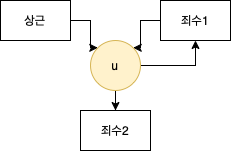

[TOC]

# 백준 9376번 - 탈옥

| 시간제한 | 메모리 제한 | 제출 | 정답 | 맞은 사람 | 정답 비율 |
| :------: | :---------: | :--: | :--: | :-------: | :-------: |
|   1초    |    256MB    | 7847 | 1260 |    907    |  25.300%  |


## 문제

상근이는 감옥에서 죄수 두 명을 탈옥시켜야 한다. 이 감옥은 1층짜리 건물이고, 상근이는 방금 평면도를 얻었다.

평면도에는 모든 벽과 문이 나타나있고, 탈옥시켜야 하는 죄수의 위치도 나타나 있다. 감옥은 무인 감옥으로 죄수 두 명이 감옥에 있는 유일한 사람이다.

문은 중앙 제어실에서만 열 수 있다. 상근이는 특별한 기술을 이용해 제어실을 통하지 않고 문을 열려고 한다. 하지만, 문을 열려면 시간이 매우 많이 걸린다. 두 죄수를 탈옥시키기 위해서 열어야 하는 문의 개수를 구하는 프로그램을 작성하시오. 문을 한 번 열면 계속 열린 상태로 있는다.


## 입력

첫째 줄에 테스트 케이스의 개수가 주어진다. 테스트 케이스의 수는 100개를 넘지 않는다.

첫째 줄에는 평면도의 높이 h와 너비 w가 주어진다. (2 ≤ h, w ≤ 100) 다음 h개 줄에는 감옥의 평면도 정보가 주어지며, 빈 공간은 '.', 지나갈 수 없는 벽은 '*', 문은 '#', 죄수의 위치는 '$'이다.

상근이는 감옥 밖을 자유롭게 이동할 수 있고, 평면도에 표시된 죄수의 수는 항상 두 명이다. 각 죄수와 감옥의 바깥을 연결하는 경로가 항상 존재하는 경우만 입력으로 주어진다.


## 출력

각 테스트 케이스마다 두 죄수를 탈옥시키기 위해서 열어야 하는 문의 **최솟값**을 출력한다.


## 예제 입력1

``` html
3
5 9
****#****
*..#.#..*
****.****
*$#.#.#$*
*********
5 11
*#*********
*$*...*...*
*$*.*.*.*.*
*...*...*.*
*********.*
9 9
*#**#**#*
*#**#**#*
*#**#**#*
*#**.**#*
*#*#.#*#*
*$##*##$*
*#*****#*
*.#.#.#.*
*********
```

## 예제 출력1

```html
4
0
9
```

## 출처

[출처](https://www.acmicpc.net/problem/9376)

## 알고리즘 분류

* 그래프 이론
* 그래프 탐색
* 너비 우선 탐색
* 다익스트라
* 0-1 너비 우선 탐색

## 접근 방법

### 그래프 모델링 

board에 존재하는 cell을 `[i][j]` 라는 이름을 가진 그래프의 정점이라고 보고

 `[u][v]`가 문일 때 `[i][j] -> [u][v]`로 가는 간선의 가중치를 1로 생각합시다. 

`[u][v]`가 문이 아닐 때 `[i][j] -> [u][v]`로 가는 간선의 가중치를 0으로 생각합시다.

<br>

그렇다면, 문제에서 `"A라는 좌표에서 최소의 문을 열고 B라는 좌표로 도착하는 경우"` 와 `[i][j]에서 시작하여 [u][v]로 도착하는 최단경로` 가 동일한 문제가 됩니다. 이러한 방식으로 그래프로 모델링 해줍니다.

---


문제를 Resolve해보면  `상근이 + 죄수 1 + 죄수2 `까지의 최단 경로를 찾는 것이 됩니다.<br>

* 상근이 + 죄수1 $\rightarrow$ **1**
*  죄수1 + 죄수2 $\rightarrow$ **2**

로 각각을 분할할 수 있습니다. `한번 열린 문은 열린 상태로 있는다`라는 조건이 존재하므로 $1 + 2 + 1 \cap 2$ 를 찾는 것이 문제의 최적해임을 알 수 있습니다.

문제의 핵심은 $1 \cap 2$ 입니다. 이것이 없다면, 단순하게 각각의 최단거리의 합이 전체 문제의 최적해임을 어렵게 않게 도출해 낼 수 있습니다. <br>

교집합의 예시로, 1번 경로에서 특정 문을 열었고, 2번 경로에서도 해당 문을 열게 될 경우 중복되게 문이 Counting 된다는 것을 알 수 있습니다. 그 경우에는 unique하게 counting하는 과정이 필요합니다.

<br>

### 교집합의 존재

핵심은 이러한 교집합을 제거하는 것에 있습니다. 

가장 먼저 생각할 수 있는 방법은, 최단 경로를 형성하는 좌표들의 집합을 메모이제이션하는 방법입니다. 하지만, 조금 더 생각해보면 특정 좌표 `[i][j]`에 방문하기 위해 최악의 경우 $h*w - 1$ 개의 정점들을 방문했을 수 있으므로 $10^4$개의 좌표 정보를 저장해야한다는 것을 알 수 있습니다. 특정 좌표`[i][j]`는 총 100 * 100 개가 존재하고 전체적으로는 $10^8$ 개의 좌표들을 저장해야합니다. 이는 메모리 제한 상 불가능 하다는 것을 알 수 있습니다.

<br>

### 교집합을 고려하지 않을 수 있는 방법에는 무엇이 있을까요?

상근 $\rightarrow$ 죄수1 $\rightarrow$ 죄수2 로 가는 경로를 연결해봅시다.



전체 경로 상에 상근이, 죄수1 그리고 죄수2가 한점에서 만나는 최초의 접점이 존재합니다. 이를 $u$라고 합시다.

최초의 접점일 경우, 이전까지의 <br>

1. 상근 $\rightarrow$ $u$
2. 죄수1 $\rightarrow$ $u$

3. 죄수2 $\rightarrow$ $u$

3가지 경로가 모두 베타적인 것을 알 수 있습니다. 즉, 겹치는 경로가 없다는 뜻입니다.


### 최초의 접점 $u$ 를 찾으려면?

이러한 접점을 찾기 위해서는 또 경로 정보가 필요하다는 딜레마가 존재합니다.

아래와 같이 2가지 경로가 존재한다고 가정합시다.<br>

1. src1 $\rightarrow$ b $\rightarrow$ c $\rightarrow$ .... $\rightarrow$ k $\rightarrow$ Dest
2. src2 $\rightarrow$ b $\rightarrow$ d $\rightarrow$ .... $\rightarrow$ k $\rightarrow$ Dest

<br>

위 예제에서 최초의 접점은 b입니다. 또 다른 접점인 k를 살펴보죠.

{src1 $\rightarrow$ k} 와 {src2 $\rightarrow$ k} 는 b라는 원소를 가지는 교집합이 존재합니다. 즉, b위치에 존재하는 것이 문이라면 중복하여 문을 카운팅한다는 뜻이죠.

{src1 $\rightarrow$ b} 와 {src2 $\rightarrow$ b} 는 중복하여 카운팅하는 문이 없습니다. 즉, 앞에서 구한 경로와 같지만 최단 거리는 더 작다는 뜻이 됩니다.

<br>어렵지 않게 다음과 같이 일반화가 가능합니다. 

> dist(a, b) := a에서 b로 가는 최단거리

* src1 와 src2의 접점을 집합$S$라고 가정할 때, 두 정점이 만난다면 최초의 접점이 존재한다.
* 집합$S$에서 최초의 접점 $u$를 제외한 나머지 정점 $v$ 에서 $dist(src, u) < dist(src, v)$ 이다.

또한, 문제 조건에 따라 항상 상근이와 죄수1,2가 만날 수 있는 경우만 고려하면 되므로  $u$ 의 존재성을 확신할 수 있습니다. 그리고 해당 $u$는 항상 `board` 상에 존재합니다.

위의 일반화된 내용에 따라,  $u$는 집합$S$의 최솟값입니다.  고로, `board`상에 임의의 점 $k$ 에 대해 $dist(상근, k) + dist(죄수1, k) + dist(죄수2, k)$ 의 최솟값이 문제의 정답이 됩니다.


### 구현

board외부에 존재하는 상근이가 board안에 접근할 수 있도록 버퍼 공간을 board의 상, 하, 좌, 우로 둡시다.

~~(이렇게 안해주면, 외벽을 모두 검사해야하는 번거로움이 존재합니다)~~

그렇게 하면 실제 board는 $[1][1]$ ~ $[h][w]$ 까지의 범위를 가집니다. 버퍼 공간은 자유롭게 움직일 수 있도록 '.'로 설정해줍시다. 그러면 상근이는 자유롭게 board 내부로 접근할 수 있습니다.

<br>

이 후, 가중치가 0과 1뿐이므로 가볍게 3번의 다익스트라를 통해 상근, 죄수1, 죄수2 로부터 시작하는 최단경로를 전부 구해줍니다. 

<br>

이 후, 버퍼 공간을 포함해 `board` 의 모든 정점들 $k$에 대해 $dist(상근, k) + dist(죄수1, k) + dist(죄수2, k)$ 의 최솟값을 찾아주는 것으로 문제를 해결할 수 있습니다.

(단, $k$가 문일 경우에는 3개의 정점들이 3번 counting을 하게 되므로 -2를 해주어 unique하게 카운팅해줍시다.)


## 소스코드

```c++
#define FASTIO cin.tie(0)->sync_with_stdio(false), cout.tie(0)
//////////////////////////////////////////////////////////////////
#include <bits/stdc++.h>
using namespace std;
char board[105][105];
long long H, W, dist[3][105][105];
vector<pair<int,int>> pos;
typedef tuple<int,int,int> tp;
const int dir[4][2] = {{-1, 0}, {1, 0}, {0, -1}, {0, 1}};
void dijkstra(int nth, int sy, int sx){
    priority_queue<tp, vector<tp>, greater<tp>> PQ;
    dist[nth][sy][sx] = 0;
    PQ.push({0, sy, sx});

    while(!PQ.empty()){
        auto [acCost, y, x] = PQ.top(); PQ.pop();
        for(int i=0; i<4; i++){
            int ny = y + dir[i][0], nx = x + dir[i][1];
            if(ny < 0 || nx < 0 || ny > H+1 || nx > W+1 || board[y][x] == '*')
                continue;
            int added = (board[ny][nx] == '#') ? 1 : 0;
            if(dist[nth][ny][nx] <= acCost + added){
                continue;
            }
            dist[nth][ny][nx] = acCost + added;
            PQ.push({dist[nth][ny][nx], ny, nx});
        }
    }
}
int main(void){
    FASTIO;
//////////////////////////////////////////////////////////////////
    int T;
    cin >> T;
    while(T--){
        long long ans = 1e9;
        cin >> H >> W;
        for(int i=0; i<105; i++){
            for(int j=0; j<105; j++)
                board[i][j] = '.';
        }
        pos.clear();
        pos.push_back({0, 0});
        for(int i=0; i<3; i++){
            for(int j=0; j<105; j++){
                for(int k=0; k<105; k++)
                    dist[i][j][k] = 1e9;
            }
        }

        for(int i=1; i<=H; i++){
            for(int j=1; j<=W; j++){
                cin >> board[i][j];
                if(board[i][j] == '$')
                    pos.push_back({i, j});
            }
        }
        for(int i=0; i<3; i++){
            dijkstra(i, pos[i].first, pos[i].second);
        }

        for(int y=0; y<=H+1; y++){
            for(int x=0; x<=W+1; x++){
                if(board[y][x] == '*') continue;
                long long ret = dist[0][y][x] + dist[1][y][x] + dist[2][y][x];
                if(board[y][x] == '#')
                    ret -= 2;
                ans = min(ans, ret);
            }
        }
        cout << ans << '\n';
    }

    return 0;
}
```

